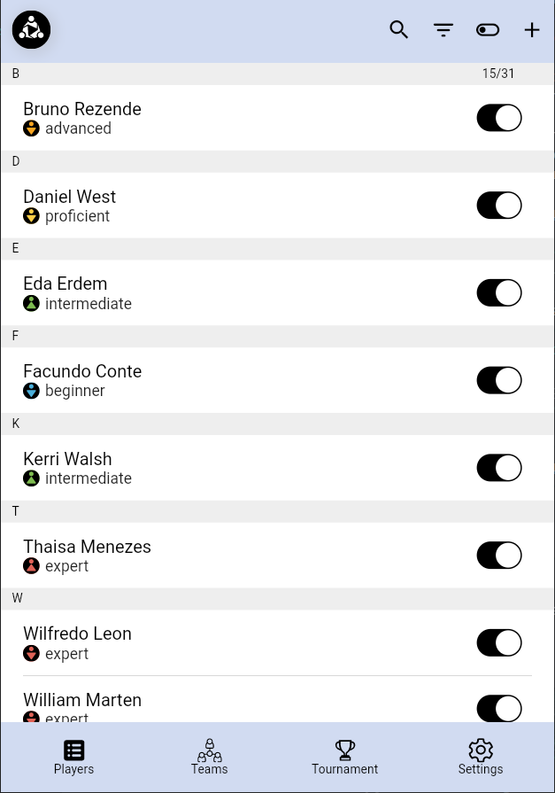
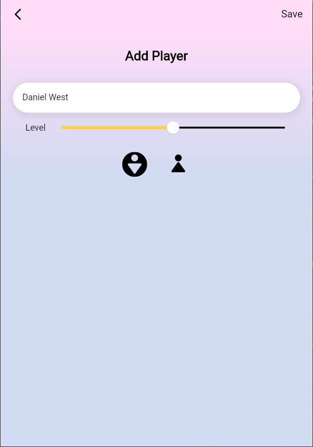
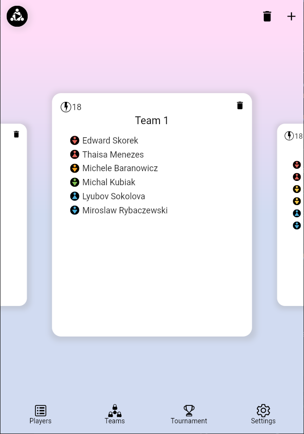
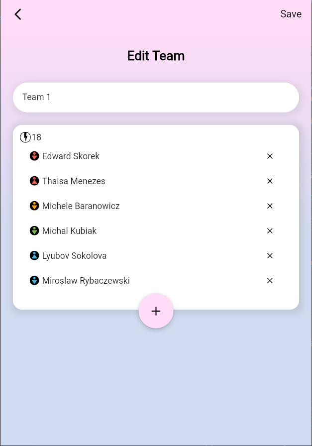
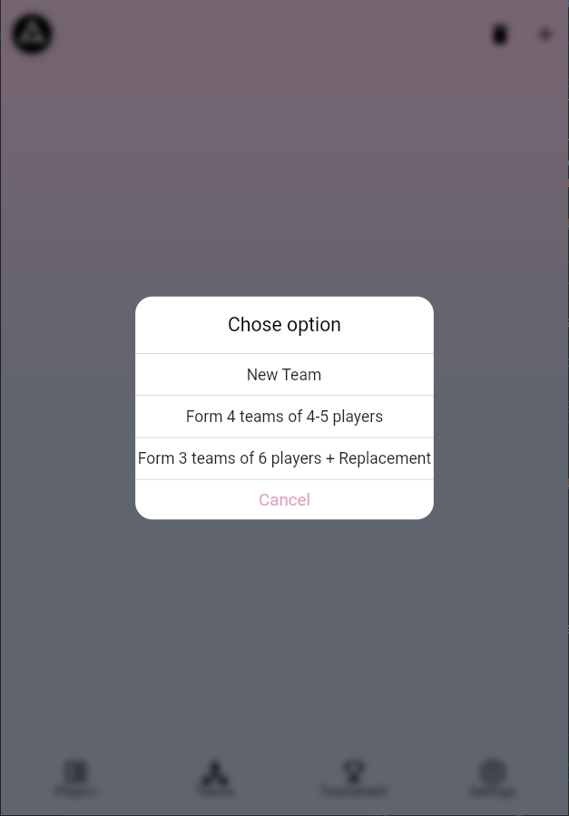
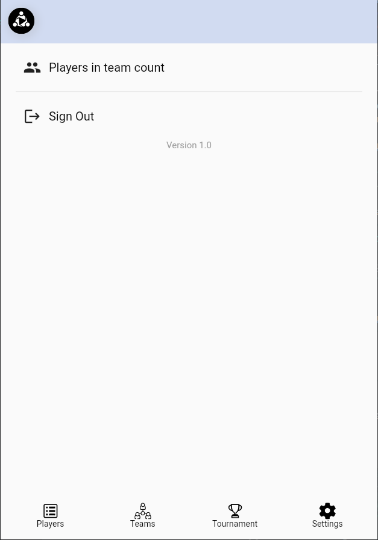

# Formar

A new Flutter application.

### Description
Formar is a mobile cross-platform application made using Flutter & Dart. 
It helps to form teams in a random way, taking into account different parameters (level and sex of player)

### Important info !!!
The view Tournament is currently not available, but in the future, this feature will be added to the application

### Technologies
Dart & Flutter, Firebase

### Screenshots
  

